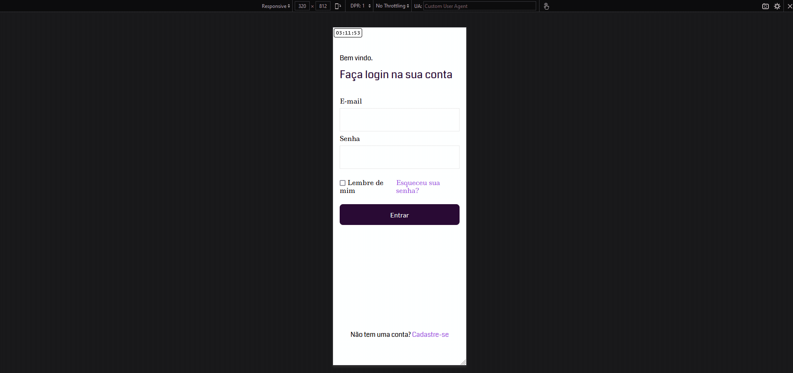

# Hackathon Vacuum - Login Page

This is a front-end project created for the Vacuum community's hackathon that I won, the challenge was to create a login screen according to the design that was given. It features a responsive login page with a unique design element of ellipses.

The design: https://github.com/Notare/hackathon-vacuum/blob/main/images/design.png

**Link to project:** https://notare.github.io/hackathon-vacuum

## How It's Made:

**Tech used:** HTML, CSS

The focus was on responsive design and attention to detail. Here's an overview of how I built it:

- Mobile-First Approach: I started by designing the login page for mobile devices, ensuring a clean and user-friendly experience for smaller screens.

- Desktop Layout: For the desktop version, I implemented a two-column layout with the logo on the left and the login options on the right. I positioned the ellipses element in the top-right corner to match the design requirements.

- CSS Styling: I applied CSS styles to achieve the desired look and feel. This included setting background colors, text formatting, and border-radius.

## Lessons Learned:

- Responsive Design: I gained a deeper understanding of responsive design principles and techniques, allowing me to create user-friendly interfaces for various screen sizes.

- Positioning Elements: The use of the position property for the ellipses elements was a valuable technique for achieving precise layout positioning.

- Continuous Learning: As an engineer, I recognize the importance of continuous learning and growth. This project reinforced my passion for front-end development and my commitment to staying up-to-date with industry trends and best practices.

I'm very proud of the final result, and I look forward to incorporating the skills and knowledge gained from this project into future projects.

## Other Projects:

**Top Albums Finder:** https://github.com/Notare/top-albums-finder

**Hades - Select Your Character:** https://github.com/Notare/hades-select-your-character

**Bia Cabeleireira (hair salon):** https://github.com/Notare/bia-cabeleireira
